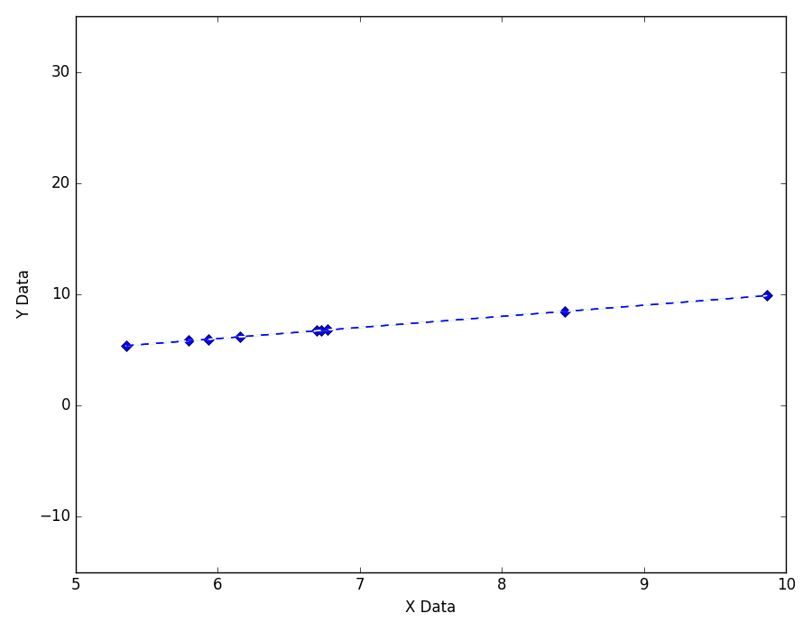
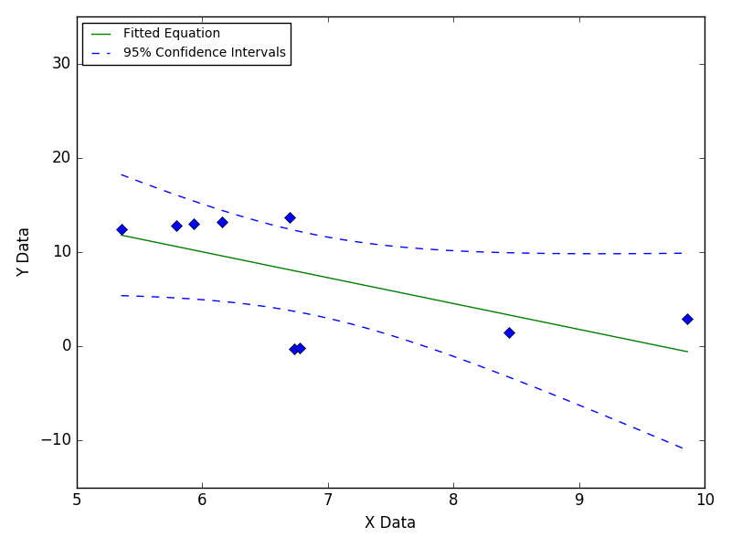
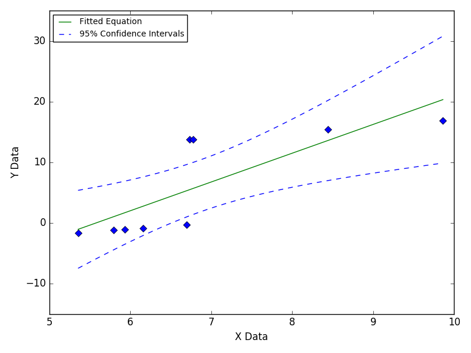

======================
Data With A Large Step
======================

This problem is often caused by environmental
changes during data collection such as a
temperature change during a lunch break.

|image0|

---- **Still Images** -----

|image1|

|image2|

|image3|

`Back to top <intro.html>`__

Based on `this GitHub example <https://github.com/zunzun/pyeq2/tree/master/Examples/CommonProblems>`__ in Python.

E-mail zunzun@zunzun.com for questions or suggestions.

