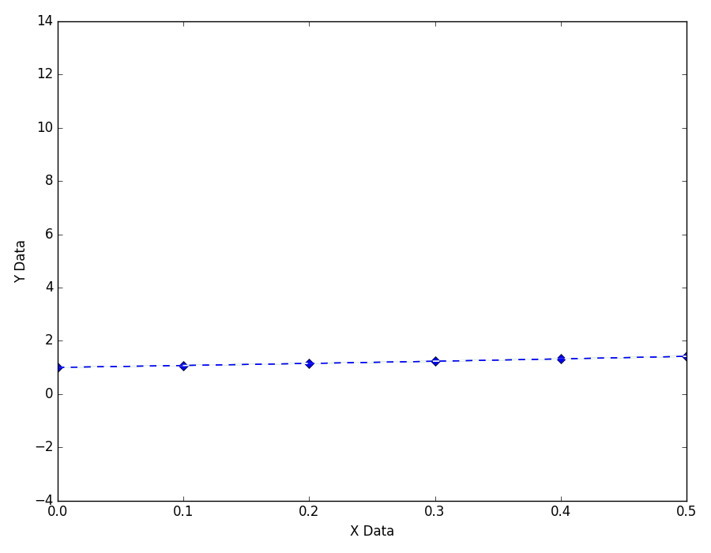
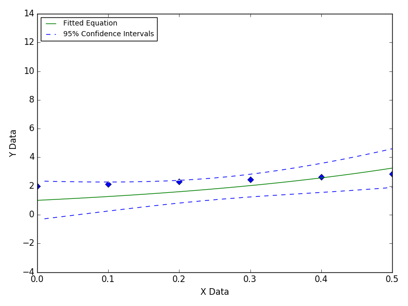
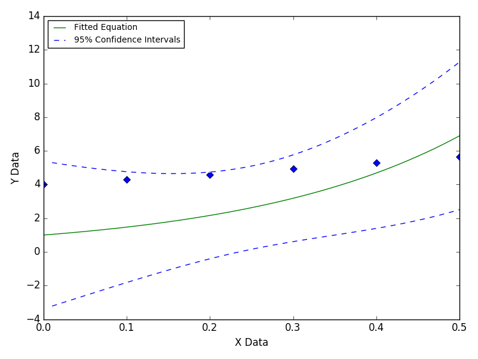

==========================
Equation Missing An Offset
==========================

This illustrates the effect of fitting data with
an offset to an equation that does not have one.

This problem can be caused by experimental
equipmentintroducing bias (such as a DC offset)
during data acquisition. Fitting the data to an
equation with an offset will reveal the bias.
|image0|

---- **Still Images** -----

|image1|

|image2|

|image3|

Based on `this GitHub example <https://github.com/zunzun/pyeq2/tree/master/Examples/CommonProblems>`__ in Python.

E-mail zunzun@zunzun.com for questions or suggestions.

