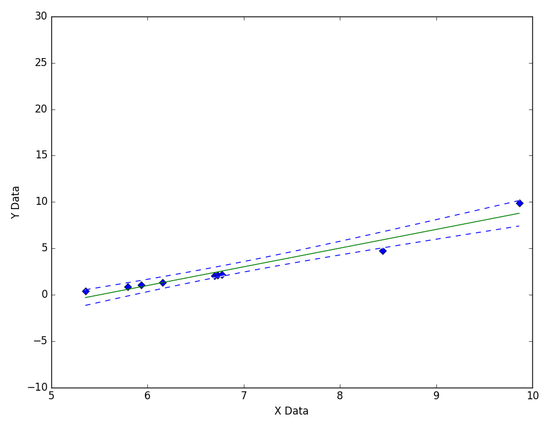
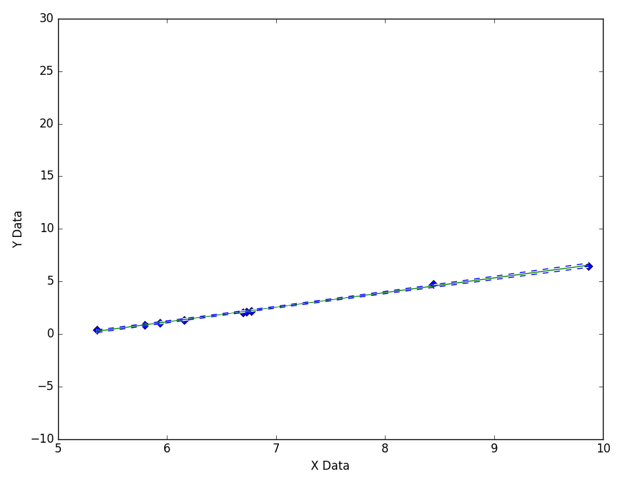
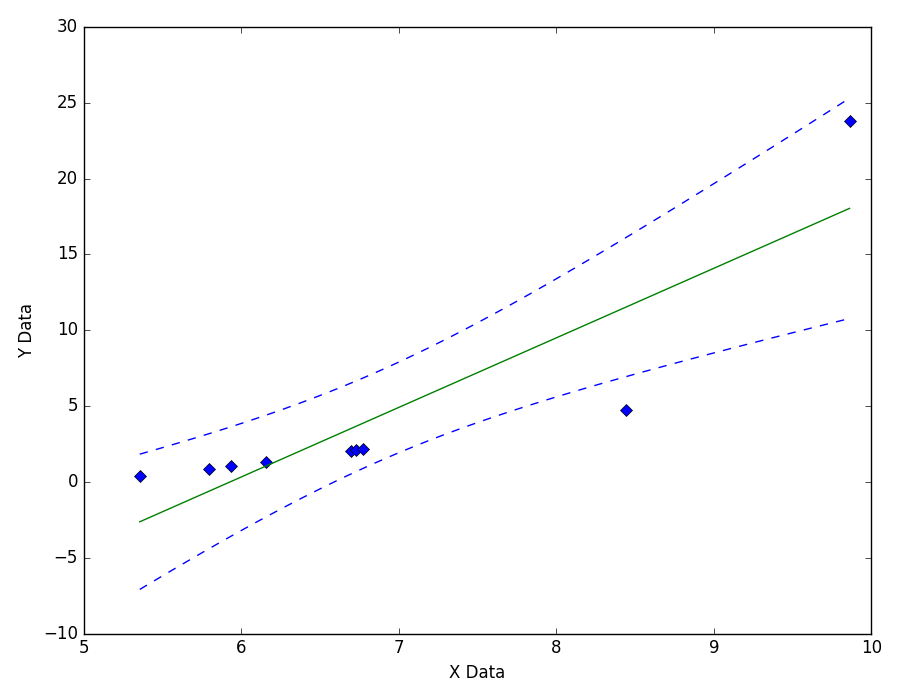
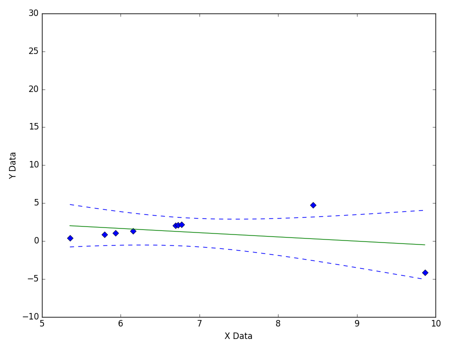

===========================
Single Outlier At End Point
===========================

Outliers are often caused by manual
errors in recording experimental data.

|image0|

---- **Still Images** -----

|image1|

|image2|

|image3|

