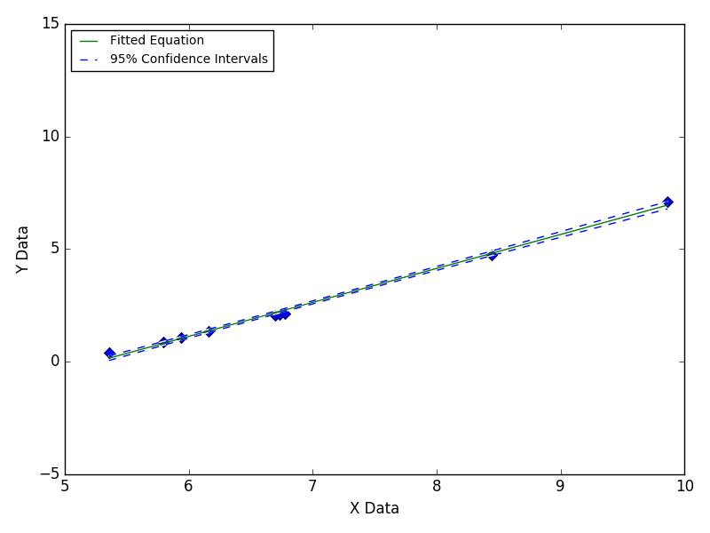
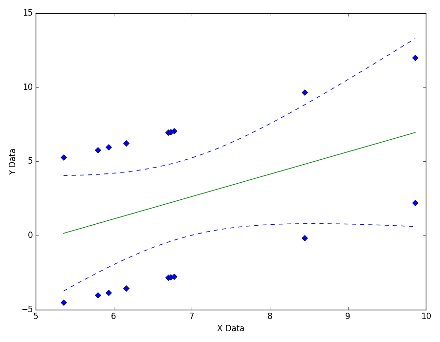

=====================
Fitting Parallel Data
=====================

This problem is often caused by environmental
changes during data collection, such as
temperature changes on different days
when making multiple data collection runs.

|image0|

---- **Still Images** -----

|image1|

|image2|

Based on `this GitHub example <https://github.com/zunzun/pyeq2/tree/master/Examples/CommonProblems>`__ in Python.

E-mail zunzun@zunzun.com for questions or suggestions.

