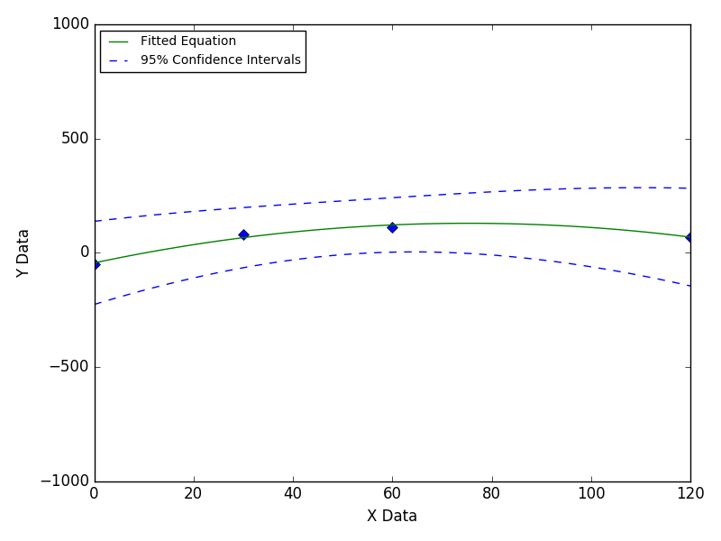
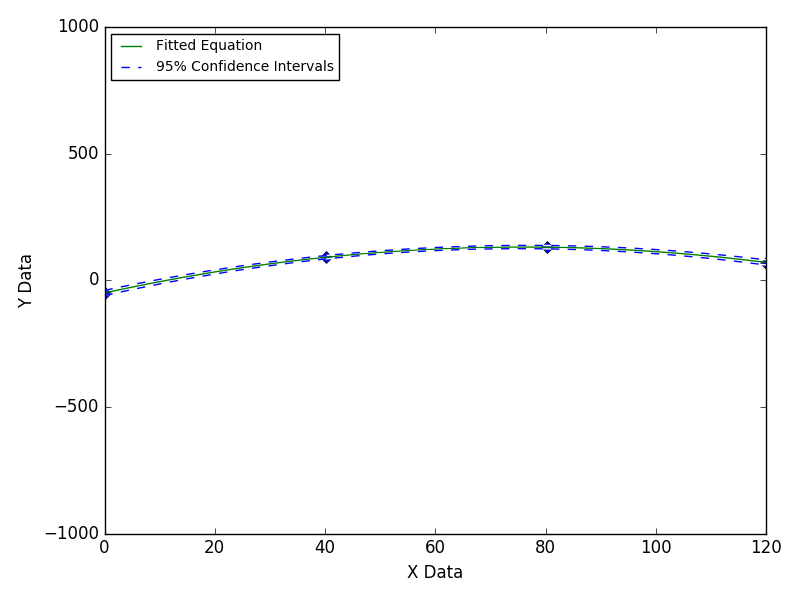
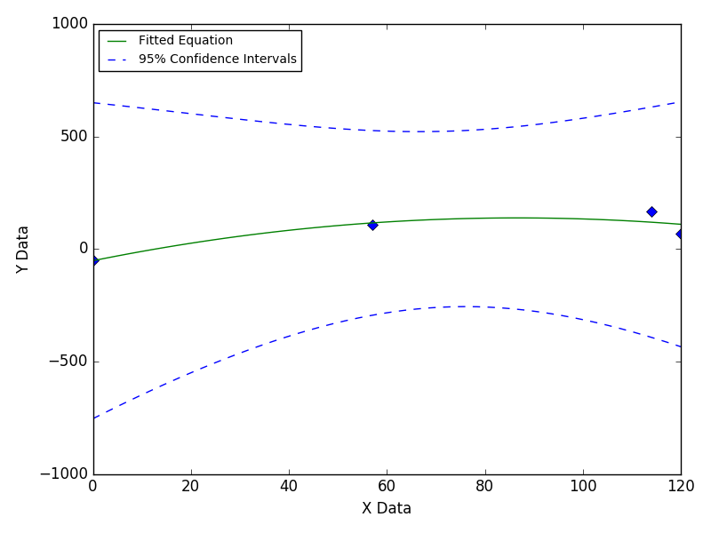
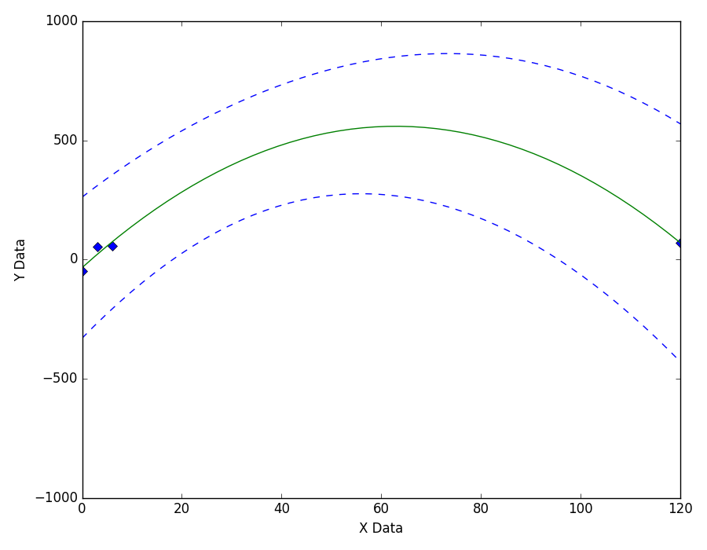

=================================
Data With A Poorly Defined Region
=================================

This problem can be mitigated by taking additional
data in the region that is poorly defined.

|image0|

---- **Still Images** -----

|image1|

|image2|

|image3|

Based on `this GitHub example <https://github.com/zunzun/pyeq2/tree/master/Examples/CommonProblems>`__ in Python.

E-mail zunzun@zunzun.com for questions or suggestions.

