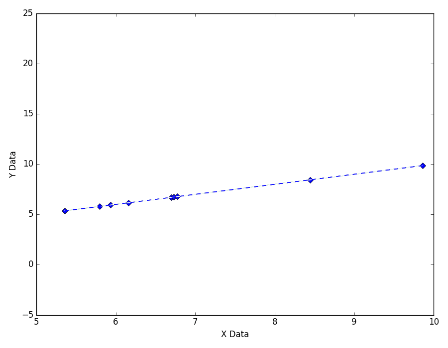
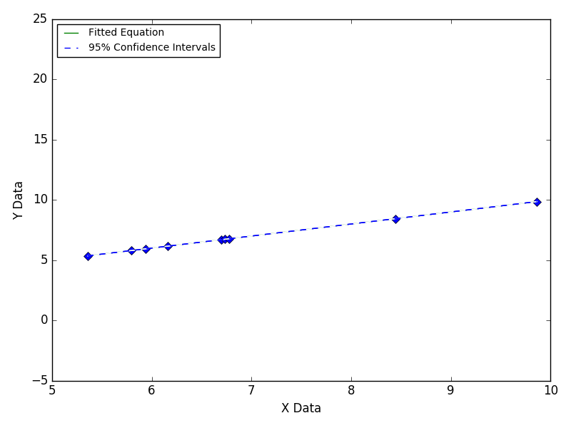
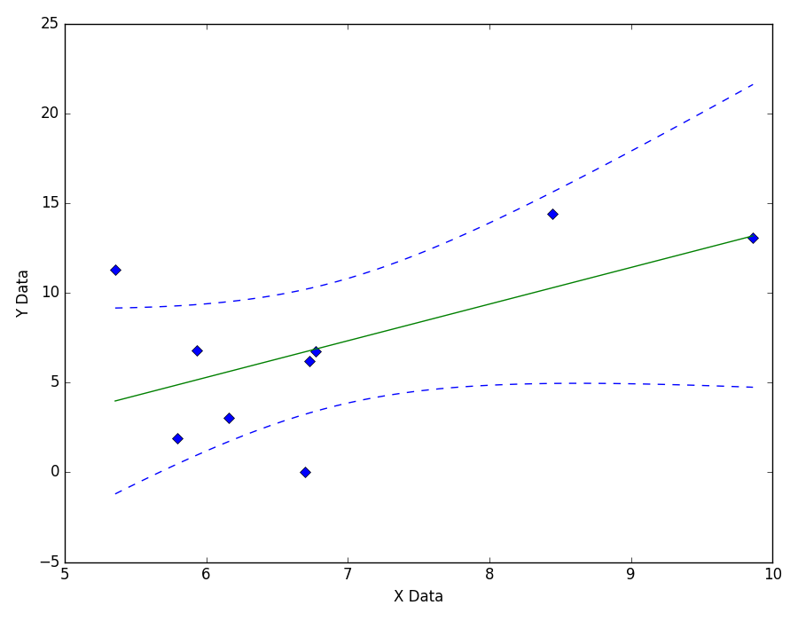

==============================
Data Scatter Over Entire Range
==============================

The effect of data scatter (noise) can be reduced
by increasing the total number of data points.

|image0|

---- **Still Images** -----

|image1|

|image2|

|image3|

`Back to top <intro.html>`__

Based on `this GitHub example <https://github.com/zunzun/pyeq2/tree/master/Examples/CommonProblems>`__ in Python.

E-mail zunzun@zunzun.com for questions or suggestions.

.. |image2| image:: Scatter_A_ci090_large.png

