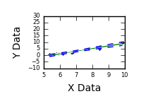
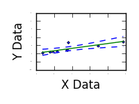
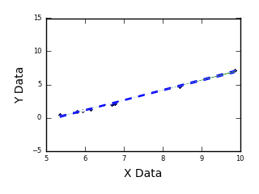
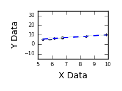
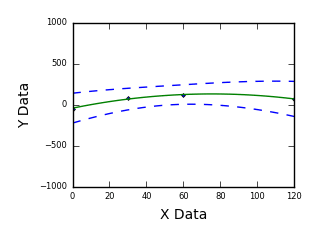
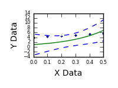
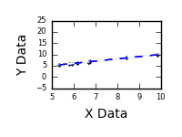
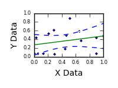

================================
Common Problems In Curve Fitting
================================

based on `this GitHub example <https://github.com/zunzun/pyeq2/tree/master/Examples/CommonProblems>`__ in Python

+----------------------------------------------+-----------------------------------------------------+
| **Data With A Poorly Defined Region**        | This problem can be mitigated by taking additional  |
| |image4|                                     | data in the region that is poorly defined.          |
|                                              |                                                     |
|                                              |                                                     |
| `High resolution animation                   |                                                     |
| and still images <PoorlyDefined_A.html>`__   |                                                     |
|                                              |                                                     |
+----------------------------------------------+-----------------------------------------------------+
| **Single Outlier At End Point**              | Outliers are often caused by manual                 |
| |image0|                                     | errors in recording experimental data.              |
|                                              |                                                     |
|                                              |                                                     |
| `High resolution animation                   |                                                     |
| and still images <Outlier_A.html>`__         |                                                     |
|                                              |                                                     |
+----------------------------------------------+-----------------------------------------------------+
| **Single Outlier At Mid Point**              | Outliers are often caused by manual                 |
| |image1|                                     | errors in recording experimental data.              |
|                                              |                                                     |
|                                              |                                                     |
| `High resolution animation                   |                                                     |
| and still images <Outlier_B.html>`__         |                                                     |
|                                              |                                                     |
+----------------------------------------------+-----------------------------------------------------+
| **Fitting Parallel Data**                    | This problem is often caused by environmental       |
| |image2|                                     | changes during data collection, such as             |
|                                              | temperature changes on different days when          |
|                                              | making multiple data collection runs.               |
| `High resolution animation                   |                                                     |
| and still images <ParallelData_A.html>`__    |                                                     |
|                                              |                                                     |
+----------------------------------------------+-----------------------------------------------------+
| **Data With A Large Step**                   | This problem is often caused by environmental       |
| |image3|                                     | changes during data collection, such as a           |
|                                              | temperature change during a lunch break.            |
|                                              |                                                     |
| `High resolution animation                   |                                                     |
| and still images <LargeStep_A.html>`__       |                                                     |
|                                              |                                                     |
+----------------------------------------------+-----------------------------------------------------+
| **Equation Missing An Offset**               | This illustrates the effect of fitting data with    |
| |image5|                                     | an offset to an equation that does not have one.    |
|                                              |                                                     |
|                                              | This problem  can be caused by experimental         |
| `High resolution animation                   | equipment introducing bias (such as a DC offset)    |
| and still images <MissingOffset_A.html>`__   | during data acquisition. Fitting the data to an     |
|                                              | equation with an offset will reveal the bias.       |
|                                              |                                                     |
+----------------------------------------------+-----------------------------------------------------+
| **Data Scatter Over Entire Range**           | The effect of data scatter (noise) can be reduced   |
| |image6|                                     | by increasing the total number of data points.      |
|                                              |                                                     |
|                                              |                                                     |
| `High resolution animation                   |                                                     |
| and still images <Scatter_A.html>`__         |                                                     |
|                                              |                                                     |
+----------------------------------------------+-----------------------------------------------------+
| **Fitting Random Data**                      | This illustrates the effect of fitting completely   |
| |image7|                                     | random data that has no relationship of any kind.   |
|                                              |                                                     |
|                                              |                                                     |
| `High resolution animation                   |                                                     |
| and still images <RandomData_A.html>`__      |                                                     |
|                                              |                                                     |
+----------------------------------------------+-----------------------------------------------------+

